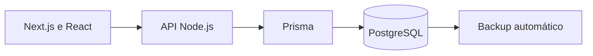

# Arquitetura

## Ambientes

- `kitchenmanager_demo`: demonstrações e testes com dados fictícios.
- Uma base independente por cliente, mantendo o schema `kitchenmanager`.

## Organização funcional

O frontend apresenta os módulos de gestão. A API valida pedidos e executa operações transacionais. O PostgreSQL mantém dados, relações e Views de reporting.
