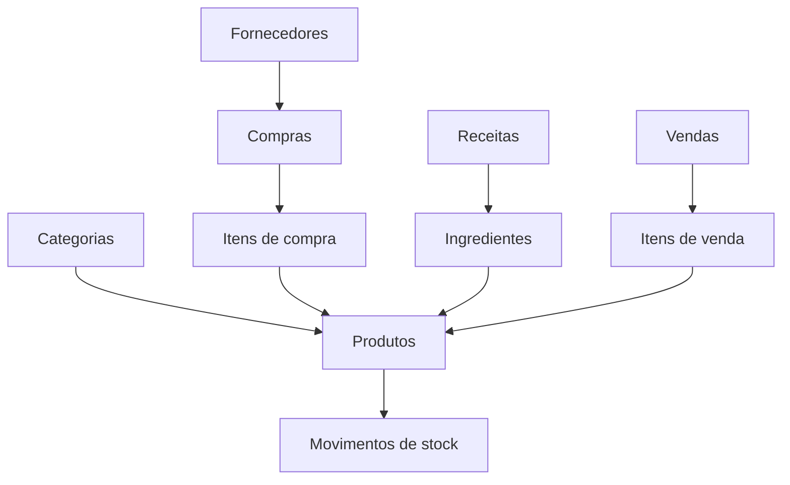

# Modelo de dados

## Entidades

| Entidade | Finalidade |
|---|---|
| categorias | Classificação dos produtos |
| produtos | Ingredientes, bebidas e produtos acabados |
| fornecedores | Entidades fornecedoras |
| compras / compra_itens | Registo das entradas adquiridas |
| receitas / receita_ingredientes | Fichas técnicas e respetivos componentes |
| movimentos_stock | Entradas, saídas e ajustes |
| vendas / venda_itens | Vendas internas demonstrativas |
